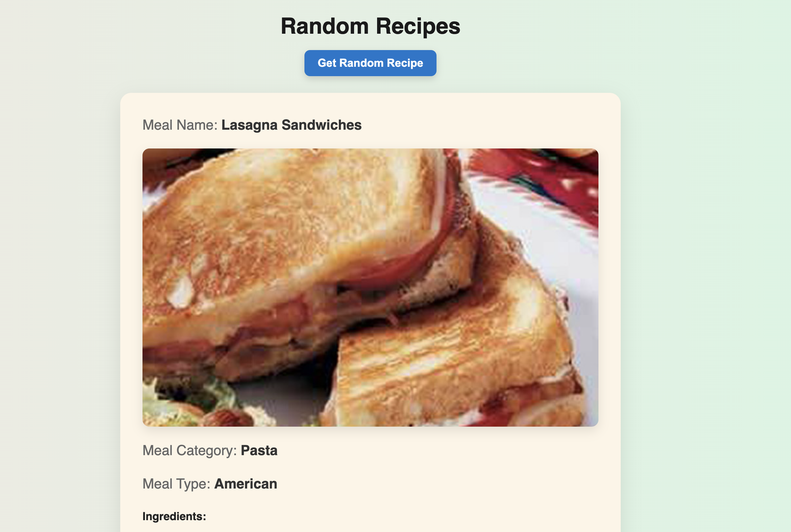

Welcome to the random recipe generator

# 🍽️ Random Recipe Generator

This is a simple web app built with Node.js, Express, and EJS that fetches a random recipe from [TheMealDB API](https://www.themealdb.com/api.php) and displays the meal name, image, ingredients, instructions, and source link.

---

## 📸 Preview

## 

## 🚀 Features

- Displays a new random recipe on every page refresh
- Clean layout with responsive styling
- Animated gradient background
- Structured ingredients and formatted instructions
- Button to generate a new recipe instantly

---

## 🛠️ Tech Stack

- Node.js
- Express.js
- EJS templating
- TheMealDB API
- CSS (no frameworks)

---

## 📦 Installation

```bash
git clone https://github.com/shanectr/random-recipe-app.git
cd random-recipe-app
npm i
node index.js
```

Open your browser and visit:
http://localhost:3000
